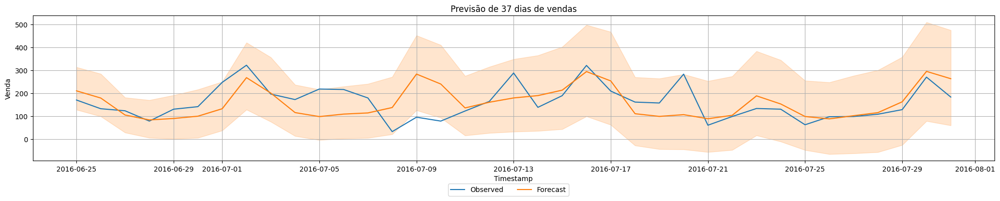

# Sales Forecasting using Autogluon
## Project #4

This project leverages Autogluon for sales forecasting, predicting future states based on historical data. Time Series Forecasting is employed as the prediction relies on temporal aspects rather than tabular data.

## Dataset

The dataset is sourced from Kaggle: [Kaggle link](https://www.kaggle.com/datasets/tevecsystems/retail-sales-forecasting/data)

It contains 937 inputs, storing sales, stock, and price data for a specific product from 2014 to 2016 on a daily basis. A sample of the data is shown below.

## Data Splitting

The data was split into 900 data points for training and the last 37 for testing.

## Model Configuration

Autogluon's "best quality" preset with 5 validation windows was utilized to enhance performance. These validation windows act as 5 training iterations, aiding the model in comprehending the data and improving future predictions.

## Results

The prediction results are depicted below. The mean squared error is around 116, indicating an average error variation of 116 points, both upwards and downwards.

This project demonstrates the application of Autogluon for effective sales forecasting, highlighting the impact of model configuration and data splitting on prediction accuracy. 
